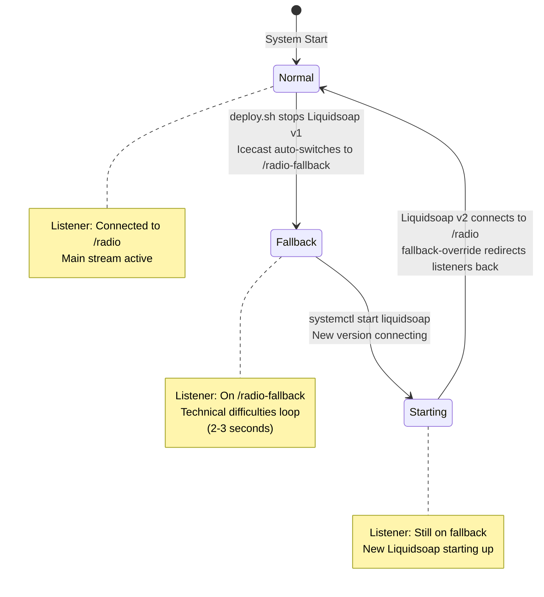
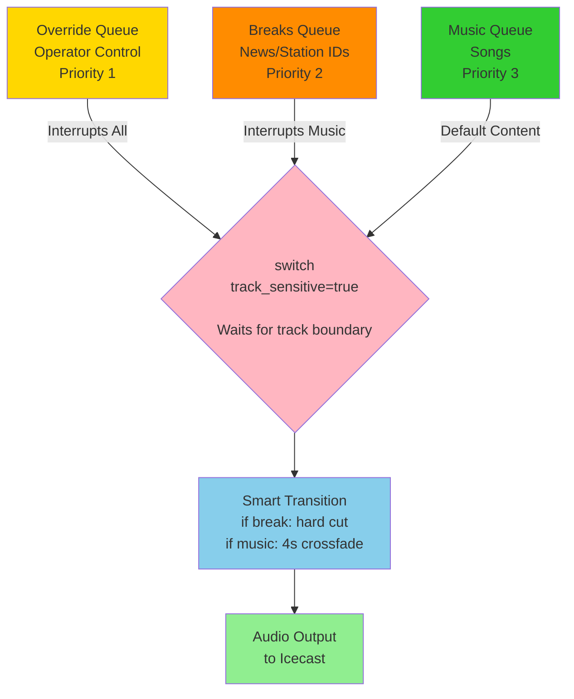
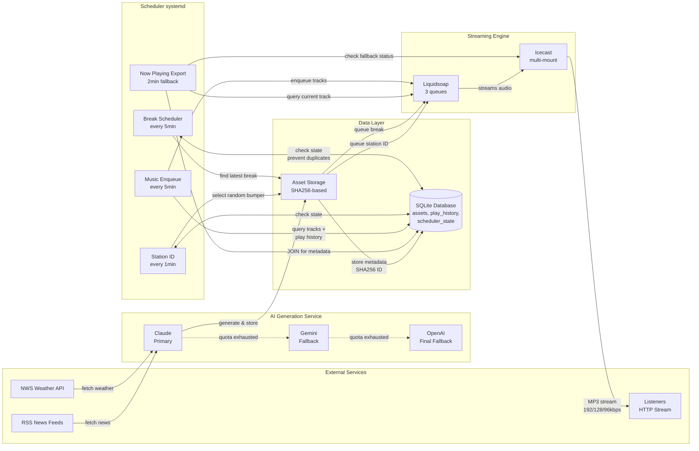

# Clanker Radio: Ten Days From Prototype to Production

[Ten days ago](https://clintecker.com/writing/im-building-an-ai-radio-station-because-my-therapist-says-i-need-hobbies-861b), I built an AI radio station as a hobby project. Today it runs 24/7 without supervision, generating contextual news breaks, switching between three AI providers when one hits quota, and deploying updates with zero dead air. The creative part (teaching an AI to sound human) took two days. The engineering part (keeping it alive) took the rest.

Listen live: [radio.clintecker.com](https://radio.clintecker.com)
View the code: [github.com/clintecker/clanker-radio](https://github.com/clintecker/clanker-radio)

---

## Part 1: The Three Pillars of an Unkillable Radio Station

### Pillar 1: The Bulletproof Stream (Zero-Downtime Deployment)

#### The Problem

Radio has no loading screen. A web server can show "Updating..." while it restarts. A mobile app can display a spinner. Radio operates in real-time. No buffering, no retry logic, no second chances. Three seconds of silence and listeners assume the station died. They switch away and don't come back.

Yet software demands updates. Bug fixes, new features, configuration changes. The naive approach stops the old process and starts the new one. This guarantees dead air. For a 24/7 automated radio station, that's unacceptable.

#### Why Standard Solutions Don't Work

Blue-green deployments work beautifully for HTTP services. Run two complete environments, switch traffic between them atomically. But that requires duplicate infrastructure. Two [Liquidsoap](https://www.liquidsoap.info/) instances, two sets of [systemd](https://systemd.io/) services, two configurations to keep synchronized. For a single-server hobby project, that's overkill.

Load balancers distribute traffic across multiple backends and route around failures. But Liquidsoap doesn't speak HTTP. It streams to [Icecast](https://icecast.org/) via persistent TCP. You can't "route around" a streaming audio source. And even with multiple instances, problems emerge: who owns the Icecast mount point? How do you prevent race conditions? How do you get smooth transitions without duplicate or skipped audio?

Running two Liquidsoap instances simultaneously seemed promising. Keep the old version running while starting the new one, then swap which feeds Icecast. But Icecast mount points are exclusive. Only one source can own `/radio` at a time. You'd need complex orchestration. Negotiate handoff, synchronize to the same track boundary, transfer queue state. The complexity spiraled.

#### The Icecast Fallback Solution

The solution came from studying Icecast's own documentation during one frustrating evening of failed deployments. Icecast supports fallback mounts, a feature designed for exactly this. Secondary streams activate automatically when the primary source disconnects. The configuration is simple:

```xml
<mount-name>/radio</mount-name>
<fallback-mount>/radio-fallback</fallback-mount>
<fallback-override>1</fallback-override>
```

The first two lines define the relationship: `/radio` is the main mount, `/radio-fallback` is the backup. When `/radio` goes offline, Icecast automatically redirects all listeners to `/radio-fallback`. That's the fallback behavior.

But `fallback-override=1` is the critical piece I initially missed. Without it, listeners moved to the fallback mount *stay* there even when the primary returns. You have to manually reconnect them. With `fallback-override=1`, Icecast performs the reverse redirect automatically. When `/radio` comes back online, listeners get moved back. No human intervention required.

#### How Deployment Works: Four States

Here's how the complete deployment cycle works, broken into four distinct states:

**State 1: Normal Operation.** Liquidsoap runs as a systemd service, streaming audio to the `/radio` mount point. Listeners connect to `https://radio.clintecker.com/radio` and hear music, news breaks, and station IDs. Everything functions normally.

Meanwhile, a second Liquidsoap instance runs in the background ([`ai-radio-liquidsoap-fallback.service`](https://github.com/clintecker/clanker-radio/blob/main/systemd/ai-radio-liquidsoap-fallback.service)), streaming to `/radio-fallback`. It plays a playlist of technical difficulties tracks: calm voices saying "We're experiencing technical difficulties. We'll be back shortly." The [fallback config](https://github.com/clintecker/clanker-radio/blob/main/config/fallback.liq) loads tracks from `assets/technical_difficulties/` and rotates through them randomly. This instance runs continuously, 24/7, even though nobody listens to it. It's insurance. Always ready, always streaming, waiting for its moment.

**State 2: Fallback Active.** I SSH into the server and run the deploy script. First command: `systemctl stop ai-radio-liquidsoap`. The main Liquidsoap process receives SIGTERM and begins shutting down. It closes its connection to Icecast gracefully.

Icecast notices the disconnect immediately. Within milliseconds, it consults its mount configuration, finds the `fallback-mount` directive, and begins redirecting listeners. Each connected client receives an HTTP 302 redirect pointing to `/radio-fallback`. Modern audio players handle this automatically. They reconnect to the new URL without user intervention.

The listener experience: music stops mid-phrase. There's a brief moment of silence, maybe half a second, while their player reconnects. Then they hear: "We're experiencing technical difficulties. We'll be back shortly." The loop repeats. They wait.

This transition takes about two seconds total: half a second for Liquidsoap to shut down, another second for clients to reconnect, half a second buffer. No dead air. The station stays live.

**State 3: New Version Starting.** With listeners safely on fallback, the deploy script proceeds: `git pull` to fetch code changes, `systemctl daemon-reload` to update service definitions, configuration file updates if needed.

Then: `systemctl start ai-radio-liquidsoap`. The new Liquidsoap instance begins its startup sequence. It loads configuration, connects to the SQLite database to query queue state, establishes Unix socket for control interface, and finally attempts to connect to Icecast's `/radio` mount.

During this startup, which takes 3-5 seconds depending on database size, listeners continue hearing the technical difficulties loop. They're patient. The fallback mount keeps streaming. No one gets disconnected.

**State 4: Recovery Complete.** The new Liquidsoap connects to `/radio` and begins streaming. Icecast detects the primary mount has returned. Because `fallback-override=1` is set, it immediately begins the reverse redirect: every client connected to `/radio-fallback` receives an HTTP 302 redirect pointing back to `/radio`.

Audio players reconnect automatically. The listener hears the tail end of "We'll be back shortly..." but then something unexpected happens. The new Liquidsoap instance has empty queues. No music has been scheduled yet. So Liquidsoap's own internal fallback chain kicks in, playing a loop: "Last Byte Radio is booting up..."

This lasts only a second or two. The [systemd wrapper script](https://github.com/clintecker/clanker-radio/blob/main/systemd/liquidsoap-wrapper.sh) that started Liquidsoap waits for the control socket to become ready, then immediately runs the music enqueue script. Music gets queued within seconds of startup. The boot-up loop stops. Normal programming continues.

From the listener's perspective: they heard 2-3 seconds of "technical difficulties," then 2-3 seconds of "booting up," then music returned. Total interruption: 4-6 seconds. No dead air. No error messages. No need to manually reconnect.

From my perspective: I ran a deploy script, waited five seconds, heard music resume. Done.

#### When Things Go Wrong

If the new Liquidsoap version has a configuration error and crashes immediately on startup, listeners stay on `/radio-fallback`. The technical difficulties loop continues playing. The station remains live. I get a systemd notification about the service failure, investigate the logs, fix the issue, and restart. Only when Liquidsoap successfully connects to `/radio` does Icecast redirect listeners back.

The fallback mount acts as a safety net. Even catastrophic failures (segfaults, missing dependencies, corrupted configuration) can't take the station offline. The worst case is that listeners hear "We're experiencing technical difficulties" on loop while I fix things. The station never goes silent.

#### Simplicity Through Discovery

This architecture came from trial and error. Early deployments were manual affairs: stop Liquidsoap, hold my breath, start it again, hope for the best. When I inevitably broke something at 2 AM, the station went dead for twenty minutes while I debugged.

The fallback mount system changed that. Now deployments are routine. I run them during the day without worrying about breaking streaming. I've deployed bug fixes while listening to my own station, hearing the brief technical difficulties message, then smooth return to music. It works.

The simplicity is the point. No orchestration frameworks. No complex state machines. No distributed consensus. Icecast's built-in fallback feature, configured correctly, doing exactly what it was designed to do. Stop, update, start. The infrastructure handles the rest.



### Pillar 2: The Unfailing Brain (Multi-Provider AI Fallbacks)

#### The Quota Problem

AI providers don't offer unlimited access. They impose quota limits on API usage. Requests per minute, requests per day, tokens per month. These limits exist for good reasons: cost control, abuse prevention, capacity management. For most applications, hitting quota means showing an error and asking the user to try again later.

A 24/7 automated radio station can't do that. There's no user to ask. There's no "try again later." Every hour needs a fresh news break. The breaks must generate on schedule, or the station plays music continuously without context. The AI isn't a nice-to-have feature. It's the concept.

#### The Wake-Up Call

I discovered this limitation the hard way. Three days into running the station, I woke up to silence in the news segments. No error alerts. No system failures. Just music playing continuously. The logs showed the pattern clearly: the break generation script called Claude, got a 429 response (quota exceeded), logged the error, and exited. The scheduler moved on. The queue stayed empty.

This happened at peak usage time. I'd been testing aggressively during development. Generating dozens of test breaks, iterating on prompts, experimenting with different TTS voices. Every test consumed quota. When the station went live and started generating breaks on a fixed schedule, I'd already exhausted most of the daily allocation. By mid-afternoon, Gemini TTS hit quota and required a billing tier upgrade.

The immediate fix was simple: wait for quota reset at midnight Pacific. But that revealed the deeper problem. A production radio station can't have scheduled downtime. I couldn't plan around quota resets. And even if I could, what about outages? Provider downtime? Network issues? Any single point of failure would take the station offline.

I needed redundancy. Not just for reliability, but for quality degradation under pressure. If the primary provider fails, fall back to a secondary. If that fails, fall back to a tertiary. Keep the station live, even if quality suffers temporarily.

#### The Dual-Chain Architecture

The solution uses two separate fallback chains, one for script generation and one for text-to-speech synthesis.

**For script generation**, the priority order is Claude, then Gemini, then OpenAI. Claude produces excellent scripts with strong structure, appropriate tone, and natural flow. When Claude writes a weather forecast, the language feels conversational without being verbose. News summaries hit the right balance between informative and engaging.

Gemini serves as the script fallback. The quality remains high. Scripts are well-structured and contextually appropriate. The main difference is subtle: Claude tends to nail the radio broadcaster voice slightly better, but Gemini is a strong second choice.

OpenAI is the final fallback for scripts. It works. The content is coherent and grammatically correct. But the writing feels more mechanical. Weather forecasts lack personality. News summaries read like bulletins rather than stories. For a station trying to sound human, that's a noticeable step down.

**For text-to-speech**, the situation is different. Anthropic doesn't offer TTS, so the fallback chain uses Gemini and OpenAI providers. The [`voice_synth.py`](https://github.com/clintecker/clanker-radio/blob/main/src/ai_radio/voice_synth.py#L291-L389) implementation tries: Gemini Pro TTS, then Gemini Flash TTS, then OpenAI TTS.

Gemini's TTS is heads and tails above the rest. The emotional range is extraordinary. The voice inflections feel natural. When reading a weather forecast, Gemini knows when to emphasize words ("We're looking at a *beautiful* day ahead"), when to convey excitement, when to express concern about storm warnings. The pacing is natural. Pauses feel intentional. It sounds like a human reading the script, not a computer synthesizing speech. Gemini Flash produces similar quality to Pro, just with slightly faster generation time.

OpenAI's TTS is functional but flat. The voice is clear and intelligible. But it lacks emotion. Everything gets read with the same monotone delivery. A sunny forecast and a storm warning sound identical. The pacing is mechanical. It works for conveying information, but it doesn't engage listeners. You can tell it's AI-generated. Better options are probably coming soon, but today it's a compromise I accept only when necessary.

The system tries providers in order until one succeeds. For a complete break generation cycle, it attempts Claude for the script, then Gemini Pro for TTS. If Claude's quota is exhausted for scripts, it falls back to Gemini for the script, then tries Gemini Pro for TTS. If Gemini Pro TTS is exhausted, it tries Gemini Flash TTS. If all Gemini options are exhausted, it uses OpenAI for both script and TTS. The fallback chains are independent: script generation can fail over to a different provider than TTS.

#### How the Fallback Works

The implementation uses a simple pattern. Here's the conceptual logic:

```python
def generate_with_fallback(prompt, providers=['claude', 'gemini', 'openai']):
    """Try each provider in order until one succeeds."""

    for provider in providers:
        try:
            response = call_provider(provider, prompt)
            if response.success:
                log_success(provider)
                return response

        except QuotaExceeded:
            log_quota_exhausted(provider)
            continue

        except APIError as e:
            log_api_error(provider, e)
            continue

    # All providers failed
    raise AllProvidersFailed("No AI provider available")
```

The actual implementation lives in [`src/ai_radio/script_writer.py`](https://github.com/clintecker/clanker-radio/blob/main/src/ai_radio/script_writer.py) around line 1413-1471. It's more complex due to provider-specific configuration, retry logic with exponential backoff, and token counting. But the core pattern is this: try, catch, continue.

Quota tracking happens implicitly. Providers return HTTP 429 status codes when quota is exceeded. The client library raises a `QuotaExceeded` exception. The code catches it and moves to the next provider. No need for proactive quota monitoring or complex state tracking. The providers tell you when you've hit limits.

This same pattern applies to TTS, with three options in the fallback chain. The fallback logic is identical: try Gemini Pro TTS first, fall back to Gemini Flash TTS if Pro is exhausted, then fall back to OpenAI TTS if both Gemini models are exhausted. The voice quality degrades when falling back, but audio keeps generating.

#### Quality Degradation in Practice

Here's what quality degradation sounds like in practice. The best-case scenario uses Claude for script generation and Gemini for TTS:

**Claude script + Gemini TTS**: "Good morning! Today's forecast calls for sunny skies and temperatures in the mid-seventies. It's a perfect day to get outside and enjoy the weather, because rain moves in tomorrow afternoon."

Gemini's voice emphasizes "perfect" and "enjoy." There's warmth and enthusiasm. The pacing feels conversational. It sounds like a human broadcaster reading well-written copy.

When Claude's quota exhausts and you fall back to Gemini for scripts, the quality remains excellent. Gemini writes strong scripts. Combined with Gemini TTS, you get coherent, engaging content with natural delivery. The degradation from Claude to Gemini scripts is minimal.

The real quality hit comes when you fall back to OpenAI for either component.

**OpenAI script + Gemini TTS**: "Today's weather: sunny, seventy-five degrees. Tomorrow: rain."

The script is terse and mechanical. But Gemini's TTS does its best to add life to it. The voice tries to find emphasis points, but there's not much to work with. It's like asking a talented actor to perform poorly written dialogue.

**OpenAI script + OpenAI TTS**: "Today's weather: sunny, seventy-five degrees. Tomorrow: rain."

The same flat script delivered in monotone. No emphasis. No inflection. No personality. It's accurate but robotic. Listeners can immediately tell it's AI-generated. It sounds like a text-to-speech system from a decade ago.

For a station trying to sound human, that degradation matters. But here's the key insight: mediocre AI-generated content is better than no content at all. A flat weather forecast still provides information. A monotone news summary still delivers headlines. The station stays on format even when running on backup systems.

I've listened to the station during fallback periods. The difference is noticeable if you're paying attention. But casual listeners don't seem to mind. The music is the main attraction. The breaks provide context and pacing. As long as they're coherent and relevant, the emotional depth is secondary.

#### When Everything Fails

What happens if all three providers are exhausted or experiencing outages?

The break generation script exits with an error code. The systemd service logs the failure. I receive an alert. But the station keeps streaming. The music queue continues playing. The most recent break remains available in the asset storage, and the scheduler can replay it if needed for continuity.

This has happened exactly once during testing. I deliberately exhausted all three providers to verify the failure mode. The station played music continuously for two hours until Gemini's quota reset. No dead air. No crashes. Just uninterrupted music without fresh breaks.

The failure is graceful. And because breaks are cached by content hash, old breaks can fill gaps. A weather forecast from yesterday is better than silence. A news summary from this morning is better than nothing.

#### The Cost Trade-Off

Cost varies by provider, though I haven't optimized for it. Claude and Gemini have similar pricing tiers for the models I use. OpenAI tends to be slightly more expensive for equivalent capability, though pricing changes frequently enough that specifics become outdated quickly.

The key insight isn't cost minimization. It's that having three providers costs more than having one, but the reliability gain justifies the expense. I'd rather pay a few extra dollars per month than wake up to a silent radio station.

And because the primary provider (Claude) handles most requests under normal operation, the secondary and tertiary providers see minimal usage. They're insurance. I pay for their APIs, but they mostly sit idle, ready for the moment they're needed.

#### Why This Matters

The multi-provider fallback isn't just about reliability. It's about accepting quality trade-offs under pressure. Perfect isn't the enemy of good. Good isn't the enemy of adequate. An adequate AI-generated break beats dead air every time.

This philosophy extends beyond AI providers. It applies to infrastructure choices, feature priorities, and operational decisions. Build systems that degrade gracefully rather than fail catastrophically. Accept temporary quality reductions to maintain availability. Plan for imperfection.

### Pillar 3: The Impeccable Timing (Queue Choreography)

#### The Scheduling Challenge

Radio isn't just about playing audio. It's about playing the right audio at the right time. News breaks belong at the top of the hour. Station IDs go at :15, :30, and :45. Music fills the gaps. The timing must be precise, or the format falls apart.

This precision is harder than it sounds for an automated system. Computers love intervals. Run this script every five minutes. Execute that task every hour. But "every hour" isn't the same as "at the top of the hour." If you start a service at 10:03 AM and run it every 3600 seconds, it triggers at 11:03, 12:03, 1:03. Close enough for many applications. Not close enough for radio.

Real radio stations use wall-clock time. The news comes at 3:00 PM, not "roughly around 3:00 PM." Station IDs play at exactly :15, :30, and :45 past the hour. Listeners expect this consistency. The timing becomes part of the listening experience.

Then there's the queue management problem. Radio content comes in three priority levels: operator overrides (highest), breaks like news and station IDs (medium), and music (lowest). Higher priority content should interrupt lower priority content, but not abruptly. You can't cut off a song mid-chorus just because a station ID is ready. You wait for the track boundary, then switch cleanly.

And within each priority level, you need intelligence. Music can crossfade smoothly from one song to the next. But breaks need hard cuts. A weather forecast that crossfades with the previous song sounds unprofessional. Similarly, a news break that crossfades into the next song destroys the separation you're trying to create.

#### Early Mistakes: When Timing Goes Wrong

The first version used cron with interval-based timing. Simple: `*/5 * * * *` for every five minutes, `0 * * * *` for every hour. It worked in testing. It fell apart in production.

The station launched at 2:17 PM on a Tuesday. Hourly break generation ran at 3:17, 4:17, 5:17. Seventeen minutes past every hour. Listeners expecting news at 3:00 got music. News came at 3:17, mid-song, cutting off the track abruptly because I hadn't implemented track-sensitive switching yet.

Station IDs were worse. They were supposed to play at :15, :30, and :45. But the cron job started when the service launched, then repeated every 15 minutes. Station IDs played at :17, :32, :47, then :02, :17, :32. The timing drifted. Some hours had four station IDs. Others had two. Chaos.

Then there were duplicates. System restarts caused timers to fire immediately. A break that queued before the restart would queue again after. Two identical news breaks in a row. The station sounded broken.

And crossfades were a disaster. Every transition used crossfade, including breaks. A weather forecast would fade in over the end of a song, with both audio streams playing for two seconds. Then a song would fade in over the end of the weather forecast. Everything blurred together. No structure.

These failures forced a redesign. Wall-clock scheduling with systemd. Database state tracking to prevent duplicates. Metadata-driven transitions. Track-sensitive switching. The system evolved from "technically functional" to "actually sounds like radio."

#### Systemd Timers: Wall-Clock Precision

The solution is systemd timers with `OnCalendar` directives. Unlike interval-based scheduling (`OnUnitActiveSec`), which drifts over time, `OnCalendar` uses wall-clock time. You can specify "every hour at :00" or "at :15, :30, and :45 past every hour."

The [break scheduling timer](https://github.com/clintecker/clanker-radio/blob/main/systemd/ai-radio-break-scheduler.timer) looks like this:

```ini
[Timer]
OnCalendar=*:0/5
Persistent=true
```

That `OnCalendar=*:0/5` means "every 5 minutes, aligned to wall clock (00, 05, 10, 15, 20, 25...)." If the system boots at 2:37 PM, the timer doesn't fire at 2:42. It waits until 2:40. Perfect alignment with wall-clock time. The scheduler script checks whether it's time to queue a break based on internal logic.

Station IDs use a different pattern:

```ini
[Timer]
OnCalendar=*:*:00
Persistent=false
```

This fires every minute on the minute. The scheduler script itself checks whether the current minute is :14, :29, or :44 (one minute before the target times) and only queues if true. Station IDs then play at :15, :30, :45. The timer provides frequent opportunities to check; the script provides the actual scheduling logic.

Music enqueueing runs on the same interval:

```ini
[Timer]
OnCalendar=*:0/5
Persistent=true
```

That `0/5` means "starting at :00, every 5 minutes." So :00, :05, :10, :15, :20, and so on. This keeps the music queue populated without constant polling.

The `Persistent=true` setting handles an important edge case. If the system is down when a timer should fire (due to maintenance, deployment, or unexpected downtime), the timer fires immediately upon system restart. This prevents missed breaks. A news break that should have run at 3:00 PM but didn't due to downtime will run as soon as the system comes back online.

#### The Three-Queue Priority System

Liquidsoap manages three separate queues with strict priority ordering:

1. **Override queue** (highest priority): Manual operator control for emergencies or special announcements
2. **Breaks queue** (medium priority): News, weather, station IDs
3. **Music queue** (lowest priority): Songs

The queues feed into a `switch` operator with `track_sensitive=true` ([see radio.liq](https://github.com/clintecker/clanker-radio/blob/main/config/radio.liq#L178-L193)):

```liquidsoap
# Simplified version for illustration
radio = switch(track_sensitive=true, [
  (queue.override, override_queue),
  (queue.breaks, breaks_queue),
  (queue.music, music_queue)
])
```

The [actual implementation](https://github.com/clintecker/clanker-radio/blob/main/config/radio.liq#L178-L192) uses predicates like `{source.is_ready(queue)}` but the principle is the same. The `track_sensitive=true` parameter is critical. Higher-priority audio can interrupt lower-priority audio, but only at track boundaries. If a station ID arrives while a song plays, Liquidsoap doesn't cut the song off immediately. It waits for the song to finish, then plays the station ID before resuming music.

This prevents jarring interruptions. Listeners hear natural transitions. A song plays to completion. A station ID plays. Music resumes. The only unusual element is timing: the station ID might play 30 seconds after :15 if the song was that long. But the interruption is clean.

The priority ordering ensures that breaks always supersede music, and operator overrides supersede everything. If you need to announce an emergency, you push to the override queue, and it plays as soon as the current track finishes, regardless of what else is queued.

#### Smart Transitions: Crossfades vs Hard Cuts

Not all transitions should sound the same. Music benefits from crossfades. A four-second crossfade between songs creates a smooth, professional sound. The outgoing song fades out over two seconds while the incoming song fades in over two seconds, with a two-second overlap in the middle. No dead air, no abrupt cuts.

Breaks require the opposite. A news break that crossfades with the previous song sounds amateurish. The separation must be clear. Music stops, news begins. News ends, music resumes. Hard cuts.

Liquidsoap can inspect track metadata to make this decision dynamically. The [transition function](https://github.com/clintecker/clanker-radio/blob/main/config/radio.liq#L146-L166) checks the file path to determine if the incoming track is a break or music:

```liquidsoap
# Simplified for illustration
def smart_transition(old_track, new_track) =
  # Check if incoming track is in /breaks/ or /bumpers/ directory
  next_file = new_track.metadata["filename"] ?? ""
  is_break = string.contains(substring="/breaks/", next_file) or
             string.contains(substring="/bumpers/", next_file)

  if is_break then
    # Hard cut for breaks - no overlap
    sequence([old_track, new_track])
  else
    # Smooth crossfade for music (4 seconds: 2s fade-out + 2s fade-in)
    add([
      sequence([fade.out(duration=2.0, old_track)]),
      sequence([fade.in(duration=2.0, new_track)])
    ])
  end
end
```

The [actual implementation](https://github.com/clintecker/clanker-radio/blob/main/config/radio.liq#L146-L166) uses parameter names `a` and `b` with `.source` accessors and includes logging, but the core logic is identical: check the file path, choose transition type accordingly.

The result is audio that flows naturally. Songs blend together. Breaks cut cleanly. Listeners hear a station that respects the format.

#### Preventing Duplicates with Database State

Here's a subtle but critical problem. Systemd timers fire on schedule. But what if a timer fires while the previous invocation is still running? Or what if the system restarts and `Persistent=true` causes an immediate trigger, but the break already queued before the restart?

Without state tracking, you get duplicates. Two station IDs in a row. Two identical news breaks. The station sounds broken.

The solution is database-backed state tracking. Each scheduler script records when it last successfully queued content. Before queuing new content, it checks:

1. **Has enough time passed?** For breaks that run hourly, don't queue another break if one was queued in the last 55 minutes. For station IDs that run at :15/:30/:45, check that we're within the 5-minute window around the target time.

2. **Is the queue already full?** Query Liquidsoap via socket to get the current queue length. If the breaks queue already has content, don't add more. One break at a time.

3. **Is this a duplicate of the most recent item?** For station IDs that cycle through a set of bumpers, track which one played last and avoid immediate repeats.

These checks live in the [Python scheduler scripts](https://github.com/clintecker/clanker-radio/blob/main/scripts/schedule_station_id.py#L50-L87). Here's the pattern:

```python
# Conceptual pattern - see actual implementation for details
current_minute = datetime.now().minute
current_hour = datetime.now().hour

# Check if we're one minute before a target time (14, 29, or 44)
target_times = [15, 30, 45]
for target in target_times:
    schedule_minute = target - 1  # One minute before target

    if current_minute == schedule_minute:
        # Check database state: did we already schedule for this hour/target?
        state_key = "station_id_scheduled"
        state_value = db.query("SELECT value FROM scheduler_state WHERE key=?", state_key)

        if state_value == f"{current_hour}:{target}":
            exit(0)  # Already scheduled for this hour

        # Schedule the station ID, update state
        db.execute("UPDATE scheduler_state SET value=? WHERE key=?",
                   f"{current_hour}:{target}", state_key)
        # ... proceed with queueing
```

The database becomes the source of truth, persisting state across restarts and preventing duplicates from multiple timer invocations, system restarts, and deployment disruptions. The logic is idempotent.

#### Music Anti-Repetition

Music scheduling has its own challenges. Play the same song twice in an hour and listeners notice. Play the same song at the same time every day and the pattern becomes obvious. You need variety.

Every time a song plays, the database records its track ID and timestamp. When enqueueing new music, the scheduler queries this history:

```python
# Don't play songs from the last 20 tracks
recent_plays = get_recently_played_ids(db_path, count=20)

# Get candidate tracks, excluding recent plays
candidates = db.query("""
    SELECT asset_id, file_path
    FROM assets
    WHERE asset_type = 'music'
    AND asset_id NOT IN (recent_plays)
    ORDER BY RANDOM()
    LIMIT 10
""")
```

The query creates a 20-track repetition window that excludes recently played songs from selection, keeping the pool of available music fresh.

The anti-repetition logic lives in [`scripts/enqueue_music.py`](https://github.com/clintecker/clanker-radio/blob/main/scripts/enqueue_music.py) and [`src/ai_radio/track_selection.py`](https://github.com/clintecker/clanker-radio/blob/main/src/ai_radio/track_selection.py). It balances variety with simplicity. No complex recommendation algorithms. Just track history, exclude recent plays, randomize the rest.

#### Dynamic Break Selection

Break scheduling has a unique timing problem. The break generation process is asynchronous. A systemd timer fires at :50 (10 minutes before the top of the hour) with 2-minute randomization to generate a fresh news break. But generation takes 30-60 seconds: fetch RSS feeds, call AI provider, generate script, synthesize speech, save audio file. Meanwhile, the break scheduler timer fires every 5 minutes to check if it should queue a break.

The 10-minute lead time gives generation plenty of runway, but there's still a potential race: if generation runs longer than expected, does the scheduler queue the old break from last hour, or wait for the new one?

The solution is dynamic selection based on file modification time. The break scheduler always queues the *most recent* break file:

```python
# Find all news break files
break_files = glob("assets/breaks/news_*.mp3")

# Sort by modification time, newest first
break_files.sort(key=lambda f: os.path.getmtime(f), reverse=True)

# Queue the newest one
newest_break = break_files[0]
liquidsoap_push(newest_break)
```

If the new break finishes generating before the scheduler runs, the scheduler queues the fresh content. If generation takes longer, the scheduler queues the most recent old break as a fallback. Either way, the station plays something relevant. A news break from 30 minutes ago is acceptable. A news break from three days ago would be stale.

This approach decouples generation from scheduling. The generator writes files on its own timeline. The scheduler picks the best available file when it needs one. They coordinate through the filesystem, not through complex IPC.

#### Why This Works

The queue choreography system works because it separates concerns cleanly:

1. **Timers handle "when"**: systemd determines when things should happen, using wall-clock time
2. **Scripts handle "what"**: Python scripts determine what content to queue, using database state
3. **Liquidsoap handles "how"**: The audio engine determines how to transition between content, using metadata inspection

No component tries to do everything. Timers don't know about content. Scripts don't know about audio transitions. Liquidsoap doesn't know about scheduling. Each piece has a clear responsibility.

The result is a system that plays the right content at the right time with the right transitions. It sounds like a real radio station because it respects the constraints that real radio stations face: wall-clock precision, priority-based interruption, professional transitions, and intelligent content selection.



---

## Part 2: From Generated Content to Broadcast Audio

A radio station is only as good as its content library. Part 1 covered how to play audio reliably. Part 2 covers how to create, store, and manage that audio. This means building a pipeline that takes raw data (weather forecasts, news headlines) and transforms it into broadcast-ready audio files that sound natural, stay consistent, and avoid repetition.

The challenge is making AI-generated content sound like real radio, not template-driven announcements. That requires three things working together: a reliable storage system that tracks what's been played, a content generation pipeline that understands the station's personality, and quality controls that catch problems before they reach listeners.

### The Foundation: A Content-Addressable Universe

#### The Problem with Runtime Dependencies

Early versions of the station had a dangerous dependency. Every time audio played, the system called [`ffprobe`](https://ffmpeg.org/ffprobe.html) to extract metadata: duration, bitrate, sample rate. This worked fine in testing. It became a bottleneck in production.

`ffprobe` is a command-line tool from the [FFmpeg](https://ffmpeg.org/) project. Every invocation spawns a subprocess, opens the audio file, parses headers, and returns JSON. For a single file, this takes 50-100 milliseconds. Negligible. But a 24/7 radio station plays thousands of files. Every music track, every station ID, every news break triggers `ffprobe`. The overhead compounds. CPU usage spikes. Disk I/O increases. The system slows down.

Worse, runtime dependencies create failure points. What if the audio file is corrupted? What if `ffprobe` crashes? What if the filesystem is slow? These errors happen at play time, when the station is live. There's no graceful recovery. The audio either plays with incorrect metadata or skips entirely.

The solution is simple but requires discipline. Extract all metadata once, during ingestion. Store it in the database. Never call `ffprobe` again at runtime.

#### SHA256: Content-Addressable Storage

Every audio file gets a SHA256 hash based on its contents. This hash becomes the file's identity. Two files with identical content produce identical hashes, even if they have different filenames or timestamps.

The hash serves multiple purposes:

**Deduplication**: If you ingest the same audio file twice, the system recognizes it immediately. Same hash, same file. No duplicate storage. No duplicate database entries. This matters for music libraries where the same track might appear in multiple source directories.

**Integrity verification**: If a file gets corrupted, its hash changes. The system can detect this and refuse to use corrupted audio. No mysterious playback glitches. No silent failures.

**Immutable references**: Once ingested, audio files never change. The hash is permanent. The database references files by hash, not by filename. Renaming or moving files doesn't break references. The content is the identity.

The storage layout is organized by content type:

```
assets/
  music/
    {sha256}.mp3
    {sha256}.mp3
  breaks/
    {sha256}.mp3
  bumpers/
    {sha256}.mp3
```

Files are named by their SHA256 hash and organized into directories by type (music, breaks, bumpers). This keeps different content types separated while using the hash as the filename for deduplication.

#### The Ingestion Pipeline

When audio enters the system, whether it's a freshly generated news break or a music track from the library, it follows the same pipeline:

1. **Hash calculation**: Read the file, compute SHA256
2. **Duplicate check**: Query database for existing hash
3. **Metadata extraction**: Run `ffprobe` once to get duration, bitrate, codec
4. **File storage**: Copy to hash-based path
5. **Database record**: Insert hash, path, metadata, type, timestamps

The [`batch_ingest_assets.py`](https://github.com/clintecker/clanker-radio/blob/main/scripts/batch_ingest_assets.py) script handles this. It's idempotent. Running it twice on the same file produces one database entry and one stored file. No duplicates. No errors.

The metadata stored includes everything Liquidsoap or the scheduler might need:

```python
# Conceptual metadata structure
{
    "sha256": "a3b5c8d2f1e4...",
    "file_path": "assets/music/a3b5c8d2f1e4....mp3",
    "duration_seconds": 243.5,
    "loudness_lufs": -18.0,
    "true_peak_dbtp": -1.0,
    "asset_kind": "music",  # or "break", "bumper"
    "title": "Track Name",
    "artist": "Artist Name",
    "ingested_at": "2024-12-19T15:23:47Z"
}
```

At runtime, the system queries the database for this metadata. No `ffprobe` calls. No filesystem operations beyond reading the actual audio data for playback. Fast, reliable, predictable.

### From Raw Text to Broadcast-Ready Audio

#### The Break Generation Pipeline

Creating a news break involves multiple steps, each with potential failure points. The pipeline must handle failures gracefully while producing broadcast-quality output.

The process starts with data gathering. For news breaks, fetch RSS feeds from configured sources. Parse the XML. Extract headlines, summaries, publication times. For weather forecasts, query the National Weather Service API for current conditions and forecasts. Gather all raw data before attempting to generate content.

Next comes script generation. This is where the AI provider fallback chain comes into play. The system constructs a detailed prompt that includes the raw data, contextual instructions, and formatting requirements. It tries Claude first, falling back to Gemini, then OpenAI if necessary. The goal is a script that sounds like a human broadcaster wrote it.

The prompt engineering matters here. Early attempts produced generic scripts. "Here's the weather. It will be sunny. Back to music." Boring. Robotic. Not radio.

#### Configuration-Driven Personality

Every aspect of the announcer's personality, tone, and delivery style is defined in environment variables and config files, which the prompt builder assembles dynamically. This isn't just a name and location. It's a complete persona specification:

**World-building**: Station name, location, timezone, world setting ("laid-back tropical island paradise"), emotional tone, and framing. The AI doesn't just read news. It filters everything through the station's lens.

**Announcer persona**: Name (DJ Coco), energy level (1-10 scale), vibe keywords ("laid-back, friendly, warm, easygoing, tropical"), and listener relationship. This defines the voice's baseline character.

**Chaos budget**: Maximum riffs per break (1), maximum exclamations (2), unhinged percentage (20%), and specific triggers for unhinged reactions ("hurricanes, tsunami warnings, coconut shortages"). This prevents AI overenthusiasm. Generic AI assistants want to be helpful and energetic. Radio DJs need restraint.

**Humor guardrails**: Priority order (observational > analogy > wordplay), allowed comedy devices ("relatable complaints, tech metaphors, quick punchlines"), banned comedy ("meme recitation, dated slang, 'fellow kids' energy, extended sketches"). The difference between clever and cringe is precise.

**Banned AI phrases**: A comprehensive list of phrases that scream "template radio" or "AI-generated." Things like "as an AI", "in today's world", "stay tuned for more", "bundle up if you're heading out", "batten down the hatches." The system actively avoids these patterns.

**Weather style**: Structure guidelines ("Give conditions and forecast in 20-30 seconds. Vary your approach."), translation rules for making technical weather relatable, and format variations. Sometimes lead with temperature, sometimes with consequences, sometimes just state conditions.

**News tone**: Normal mode ("laid-back, friendly, conversational"), serious mode triggers ("deaths, disasters, violence, accidents"), and ethical boundaries ("no joking about victims, no punching down, no conspiracy framing").

The prompt builder assembles all of this into a comprehensive system prompt that gets sent with every script generation request. Claude receives not just "write a weather forecast" but "you are DJ Coco, broadcasting from Coconut Island, energy level 5, maximum 1 riff, no clichés about bundling up, here's what the weather data says, make it sound like island radio."

This configuration-driven approach means quality degradation has texture. When the system falls back from Claude to Gemini to OpenAI, the personality constraints stay consistent. All three providers receive the same detailed instructions. The scripts get flatter and more mechanical, but they don't suddenly become generic weather reports. They're still trying to be DJ Coco. They're just less good at it.

#### Director Prompts for Natural Speech

Text-to-speech synthesis is deceptively complex. You can't just send a script to the TTS API and expect broadcast-quality audio. The voice needs direction.

For Gemini TTS, the system uses a "director prompt" technique ([`voice_synth.py:154-196`](https://github.com/clintecker/clanker-radio/blob/main/src/ai_radio/voice_synth.py#L154-L196)) that provides detailed instructions for:

1. **Voice selection**: Specific voice model (Gemini Pro or Flash TTS) and voice variant (Kore)
2. **Character context**: DJ Coco's background, personality, world setting, emotional tone
3. **Scene setting**: Late-night broadcast booth, post-collapse setting, solo shift atmosphere
4. **Vocal technique**: Relaxed delivery, flat affect with dry warmth, chest voice, natural pauses, occasional vocal fry
5. **Delivery style**: Pacing, breath control, pitch range, emphasis patterns

The director prompt wraps the script with theatrical direction:

```
# AUDIO PROFILE: DJ Coco
Post-collapse radio operator. Solo overnight shifts, mid-30s.

## STATION: Last Byte Radio, Coconut Island

## SCENE
Late-night broadcast booth. Flickering LED panels. Low equipment hum.
That 2am energy.

### VOCAL TECHNIQUE
- Relaxed soft palate (no vocal smile, avoid brightness)
- Flat affect with occasional dry warmth
- Natural micro-pauses between thoughts
- Measured breath - let exhaustion show in pacing

### TRANSCRIPT
[The actual script goes here]
```

This approach gives the TTS engine rich context for how to deliver the script. The voice sounds natural because the AI understands the character, setting, and mood. After TTS generation, all audio files go through broadcast normalization during ingestion ([`audio.py:normalize_audio`](https://github.com/clintecker/clanker-radio/blob/main/src/ai_radio/audio.py#L123-L246)) using ffmpeg-normalize to achieve -18 LUFS target loudness and -1 dBTP true peak limiting.

#### Anti-Repetition and Temporal Context

A subtle but important detail: weather forecasts need variety even when conditions don't change. Three days of sunny weather can't produce three identical forecasts. The repetition becomes obvious to regular listeners.

A rotating log file tracks recently used weather phrases. Before generating a forecast, the script builder reads this log and provides it to the AI as negative context. "Don't use these phrases again: beautiful day, perfect weather, abundant sunshine." The AI finds new ways to describe the same conditions.

File-based locking in [`src/ai_radio/script_writer.py`](https://github.com/clintecker/clanker-radio/blob/main/src/ai_radio/script_writer.py) (lines 49-92) handles this. Each weather generation appends phrases to a shared file. The next generation reads recent entries and excludes them from the new script. Simple, effective, no complex state management.

Temporal context also matters. Morning forecasts should sound different from evening forecasts, even for the same day. Morning: "Here's what to expect today." Evening: "Here's what we saw today, and here's tomorrow's outlook." Passing the current time as context lets the scripts adapt naturally.

News breaks work similarly, tracking which stories appeared in recent breaks and deprioritizing them for the next cycle. Breaking news takes precedence. Older stories gradually fade from rotation. The news stays fresh without manual curation.

#### Quality Control and Fallbacks

Not every generated break is usable. Sometimes the AI produces scripts that are too long, too short, or tonally inappropriate. Sometimes TTS synthesis produces audio with artifacts or mispronunciations severe enough to sound broken.

Generated content goes through validation before ingestion:

**Length validation**: Break scripts must fit within time constraints. News breaks: 90-120 seconds. Weather forecasts: 45-60 seconds. Scripts that exceed limits get rejected, and generation retries with stricter length constraints in the prompt.

**Content validation**: Scripts must include required elements. Weather forecasts need current conditions AND a forecast. News breaks need multiple stories, not just one.

**Audio validation**: Generated MP3 files must pass basic quality checks. Valid MP3 structure. Duration matches expected length. No obvious audio glitches detectable by examining the waveform.

Validation failures trigger regeneration, usually with the next provider in the fallback chain. If Claude produces an overlong script, the system tries Gemini with an even more explicit length constraint. If all providers fail validation, the system falls back to the most recent valid break of that type.

This graceful degradation means the station never goes silent. Even if real-time generation fails completely, cached content from previous successful generations keeps the format intact. A weather forecast from six hours ago is better than no forecast at all.

---

## Part 3: The Data Nervous System

The system architecture diagram shows how data flows through Clanker Radio. But diagrams hide complexity. The real challenge isn't drawing boxes and arrows. It's making sure data flows reliably, state stays consistent, and components coordinate without tight coupling.

#### The Database as Source of Truth

[SQLite](https://sqlite.org/) sits at the center of the system. This choice surprises people. "Isn't SQLite just for prototypes?" No. SQLite is production-ready for workloads like this. A radio station generates modest write traffic. A few dozen database transactions per hour for break scheduling and play logging. Read queries are frequent but simple. "Get tracks that haven't played in the last 20 songs." "Find the most recent news break." SQLite handles this easily.

The database stores three types of data:

**Assets**: Every audio file's metadata. SHA256 hash, file path, duration, type, title, artist. This is the canonical record. When Liquidsoap needs to know how long a track is, it queries the database. When the scheduler needs to find available music, it queries the database. The database is always right.

**Play history**: Every track that has played, with timestamps. This drives anti-repetition logic. The scheduler queries this table constantly. "Which tracks played in the last 20 plays?" "Has this artist played recently?" "What time did we last play this song?" The history provides memory.

**Scheduler state**: When did each scheduler last run? What was the last station ID played? Which news stories appeared in the last break? This prevents duplicates and enables smart content rotation. The state persists across restarts, deployments, and crashes.

The database isn't just storage. It's coordination. Components don't talk to each other directly. They read and write database state. The break generator writes a new break. The break scheduler reads recent breaks. The play history tracker writes what's playing. The music scheduler reads what's played. The database mediates all interactions.

#### Systemd Timers as the Nervous System

Four systemd timers drive all scheduled activity:

**Music enqueue timer** ([`ai-radio-enqueue.timer`](https://github.com/clintecker/clanker-radio/blob/main/systemd/ai-radio-enqueue.timer), every 5 minutes): Runs [`enqueue_music.py`](https://github.com/clintecker/clanker-radio/blob/main/scripts/enqueue_music.py). Queries database for tracks that haven't played in the last 20 songs. Pushes tracks to Liquidsoap's music queue via Unix socket. Keeps the station playing even if other timers fail.

**Break scheduler timer** ([`ai-radio-break-scheduler.timer`](https://github.com/clintecker/clanker-radio/blob/main/systemd/ai-radio-break-scheduler.timer), every 5 minutes): Runs [`schedule_break.py`](https://github.com/clintecker/clanker-radio/blob/main/scripts/schedule_break.py). Checks if the current time falls within the 0-5 minute window at the start of each hour. If yes, finds the most recent news break file (by modification time) and pushes it to Liquidsoap's breaks queue. Database state tracking prevents duplicate scheduling within the same hour.

**Station ID timer** ([`ai-radio-schedule-station-id.timer`](https://github.com/clintecker/clanker-radio/blob/main/systemd/ai-radio-schedule-station-id.timer), every minute): Runs [`schedule_station_id.py`](https://github.com/clintecker/clanker-radio/blob/main/scripts/schedule_station_id.py). Checks if the current minute is :14, :29, or :44 (one minute before target times). If yes, selects a random station ID bumper and queues it to play at the next track boundary (:15, :30, :45). Database state prevents duplicate scheduling within the same hour.

**Now playing export** ([`ai-radio-export-nowplaying.timer`](https://github.com/clintecker/clanker-radio/blob/main/systemd/ai-radio-export-nowplaying.timer), every 2 minutes fallback): Runs [`export_now_playing.py`](https://github.com/clintecker/clanker-radio/blob/main/scripts/export_now_playing.py). In normal operation, this script is triggered immediately by [`record_play.py`](https://github.com/clintecker/clanker-radio/blob/main/scripts/record_play.py) whenever Liquidsoap switches tracks. The timer is a safety net that only runs if the immediate trigger fails. Queries Liquidsoap for current track via Unix socket, joins with database for metadata, exports to JSON for the website.

The timers are independent. Music can keep playing even if break generation fails. Station IDs can queue even if the now-playing export crashes. Failures are isolated. The system degrades gracefully.

#### Liquidsoap: The Audio Engine

Liquidsoap receives audio from three sources. The override queue for operator control. The breaks queue for news and station IDs. The music queue for songs. It handles all audio processing: crossfading, volume normalization, encoding to multiple bitrates. It streams to Icecast continuously.

Communication with Liquidsoap happens via Unix socket. Python scripts connect to `/run/liquidsoap/radio.sock`, send commands, parse responses. Simple protocol. No complex libraries. Commands like "breaks.queue" list queued breaks, "request.metadata <id>" gets track info, "breaks.push <path>" adds a track. The socket interface is the API.

Here's the conceptual pattern (see [actual implementation](https://github.com/clintecker/clanker-radio/blob/main/scripts/export_now_playing.py) for full details including buffering, error handling, and priority queue logic):

```python
# Simplified illustration of Unix socket communication
sock = socket.socket(socket.AF_UNIX, socket.SOCK_STREAM)
sock.connect('/run/liquidsoap/radio.sock')

# Query queue
sock.send(b'music.queue\n')
response = sock.recv(4096).decode()

# Parse response to get request IDs
request_ids = response.strip().split()

# Query metadata for first track
sock.send(f'request.metadata {request_ids[0]}\n'.encode())
metadata_response = sock.recv(4096).decode()

# Parse and export
# ... (actual code includes database joins, JSON formatting, etc.)
```

This loose coupling is intentional. Liquidsoap doesn't know about the database. The scheduler doesn't know about audio processing. Components interact through simple interfaces: files, database tables, socket commands.

#### Icecast: The Distribution Layer

Liquidsoap encodes the audio source three times at different bitrates ([`radio.liq:286-325`](https://github.com/clintecker/clanker-radio/blob/main/config/radio.liq#L286-L325)) and streams all three to Icecast simultaneously: 192kbps to `/radio`, 128kbps to `/radio-128`, and 96kbps to `/radio-96`. Icecast distributes these as separate mounts. Listeners connect to the mount that matches their bandwidth needs. No transcoding happens in Icecast; Liquidsoap does all encoding.

Icecast also handles the fallback mount system that enables zero-downtime deployments. When the primary mount disconnects, it redirects listeners to the fallback. When the primary reconnects, it redirects them back. All of this happens without the scheduler or database being involved. The streaming layer is independent.

The now-playing export queries Icecast's status to determine if the station is in fallback mode. If so, it adds a flag to the exported JSON. The website displays "Technical difficulties, we'll be right back." Listeners know the situation.

#### External Data Sources

External data sources run on independent schedules:

**NWS Weather API**: Hourly queries for current conditions and forecasts. JSON responses get cached locally. If the API is down, cached data keeps weather breaks running with slightly stale information rather than failing completely.

**RSS news feeds**: Multiple sources polled every 30 minutes. XML parsed into structured data. Stories ranked by recency and relevance. Top stories feed into break generation. This runs independently of the break scheduler, so fresh data is always available when needed.

**AI providers**: Claude, Gemini, and OpenAI APIs get called on-demand during break generation. No scheduled polling. The fallback chain handles quota exhaustion and outages. External dependencies don't block the main flow.

#### The Now-Playing Pipeline

The now-playing export deserves special attention because it demonstrates how components coordinate. In normal operation, [`record_play.py`](https://github.com/clintecker/clanker-radio/blob/main/scripts/record_play.py) triggers [`export_now_playing.py`](https://github.com/clintecker/clanker-radio/blob/main/scripts/export_now_playing.py) immediately whenever Liquidsoap switches tracks (via the `on_track` callback). A 2-minute systemd timer acts as a fallback safety net if the immediate trigger fails. Each export:

1. **Query Liquidsoap**: "What's playing right now?" Get back a track identifier or file path
2. **Join with database**: Look up metadata for that track. Get title, artist, duration, album art
3. **Check Icecast status**: Is the station on the main mount or the fallback mount?
4. **Atomically write JSON**: Create a temporary file, write complete JSON, rename over the old file
5. **Log errors**: If any step fails, log but don't crash. The previous export remains valid

The atomic write is critical. Web requests read the JSON file constantly. If a request arrives mid-write, it might see incomplete or corrupted data. The temp-file-then-rename pattern ensures readers always see valid JSON. Either the old version or the new version, never a partial write.

The entire pipeline runs in under 100 milliseconds. Fast enough that the display updates immediately on track changes. The event-driven approach (trigger on track change) is more responsive than polling, and the fallback timer catches edge cases where the immediate trigger fails.

#### Why This Architecture Works

Loose coupling and independent deployability make this work:

**Database changes** don't require restarting Liquidsoap. Add a column, migrate data, update schedulers. The audio keeps playing.

**Scheduler changes** don't require restarting Icecast. Fix a bug in music selection, redeploy the script. The stream stays live.

**Liquidsoap changes** don't require database migrations. Adjust crossfade timing, restart the audio engine. The schedulers keep running.

**Deployment happens component by component**. Update the break generator without touching the music scheduler. Update the music scheduler without touching Liquidsoap. Deploy in small increments. Test each change independently.

**Failures are isolated**. If the now-playing export crashes, music keeps playing. If the station ID scheduler bugs out, news breaks still work. If Icecast restarts, Liquidsoap reconnects automatically.

The architecture isn't novel. It's boring. Database, timers, queues, loose coupling. But boring architectures are reliable. And for a 24/7 radio station that no one actively monitors, reliability matters more than cleverness.



---

## Conclusion: Key Engineering Lessons

Ten days transformed a prototype into production infrastructure. The lessons learned apply beyond radio stations, beyond AI projects, to any system that needs to run reliably without constant attention.

### 1. State Belongs in the Database

Early versions stored state in memory and files. Which station ID played last? Check a global variable. When did the break scheduler last run? Check a timestamp file. This worked until the first restart. State vanished. Duplicates appeared. The system lost its memory.

Moving all state to SQLite fixed this immediately. Scheduler state, play history, duplicate prevention, all persistent. Restarts became routine. Deployments stopped causing chaos. The database became the source of truth, and the system became reliable.

The lesson: Don't fight the database. Use it for what it's good at. Atomic updates, queries, persistence. State management is hard. Let the database handle it.

### 2. Abstract Your AI Providers

The first AI integration called Claude directly. Hard-coded API keys, hard-coded model names, hard-coded error handling. When Claude hit quota, the station stopped generating content. No fallback. Total failure.

Building the provider abstraction layer felt like over-engineering at first. Interfaces, fallback chains, quota tracking. Extra complexity. But that complexity paid off the first time a provider hit quota. The system switched to Gemini automatically. The station kept running. No manual intervention.

The lesson: Abstract external dependencies, especially ones with quotas or rate limits. Build fallback chains. Test them by deliberately exhausting your primary provider. Make failure modes routine, not catastrophic.

### 3. Use the Right Tool for the Job

The temptation to build everything in Python was strong. Liquidsoap could be replaced with Python audio libraries. Icecast could be replaced with a Python streaming server. systemd timers could be replaced with Python's schedule library. Everything unified, everything under my control.

This would have been a mistake. Liquidsoap handles audio processing better than any Python library I could use. It's mature, stable, designed for radio. Icecast has been serving audio streams for decades. It's boring technology that works. systemd timers integrate with the OS, handle failures gracefully, and don't require a daemon process.

The lesson: Use boring technology. Use tools designed for the specific problem you're solving. Your custom solution will be worse than the established tool, and you'll spend time maintaining it instead of building your actual application.

### 4. Solve Ingestion First

The biggest time-saver was solving asset ingestion early. Content-addressable storage, metadata extraction at ingestion time, database records for everything. This foundation enabled everything else. No runtime `ffprobe` calls. No file path juggling. No duplicate detection logic scattered through the codebase.

Other projects often defer ingestion. "We'll figure out storage later. Let's just get it working first." This creates technical debt immediately. Every component that touches files needs custom logic. Every deployment risks breaking file references. Every bug investigation requires checking multiple places.

The lesson: Solve your data model and ingestion pipeline before building features. Get metadata extraction right. Get deduplication right. Get storage paths right. Everything else builds on this foundation.

---

Building Clanker Radio taught me that reliability comes from boring choices. Databases for state. Established tools for specific tasks. Fallback chains for external dependencies. Content-addressable storage for assets. None of this is novel. All of it works.

The station runs 24/7 now. I check it occasionally, usually just to listen. The infrastructure handles itself. Quotas exhaust, fallbacks kick in. Services restart, state persists. Deployments happen, listeners stay connected. The system degrades when things go wrong, and recovers automatically when they go right.

That's the goal. Build systems that work without you. Use boring technology. Plan for failure. Keep components loosely coupled. Let specialized tools handle specialized tasks. And when something does go wrong, debug it quickly and fix it without taking everything offline.

The code is on GitHub: [github.com/clintecker/clanker-radio](https://github.com/clintecker/clanker-radio). The station is live: [radio.clintecker.com](https://radio.clintecker.com). And in ten more days, I'll probably write about what I learned next.

---

*🤖 Generated with collaboration between CLiNT and Claude Code*
