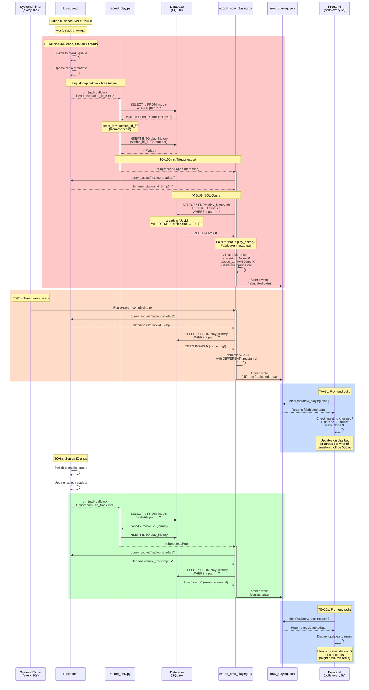
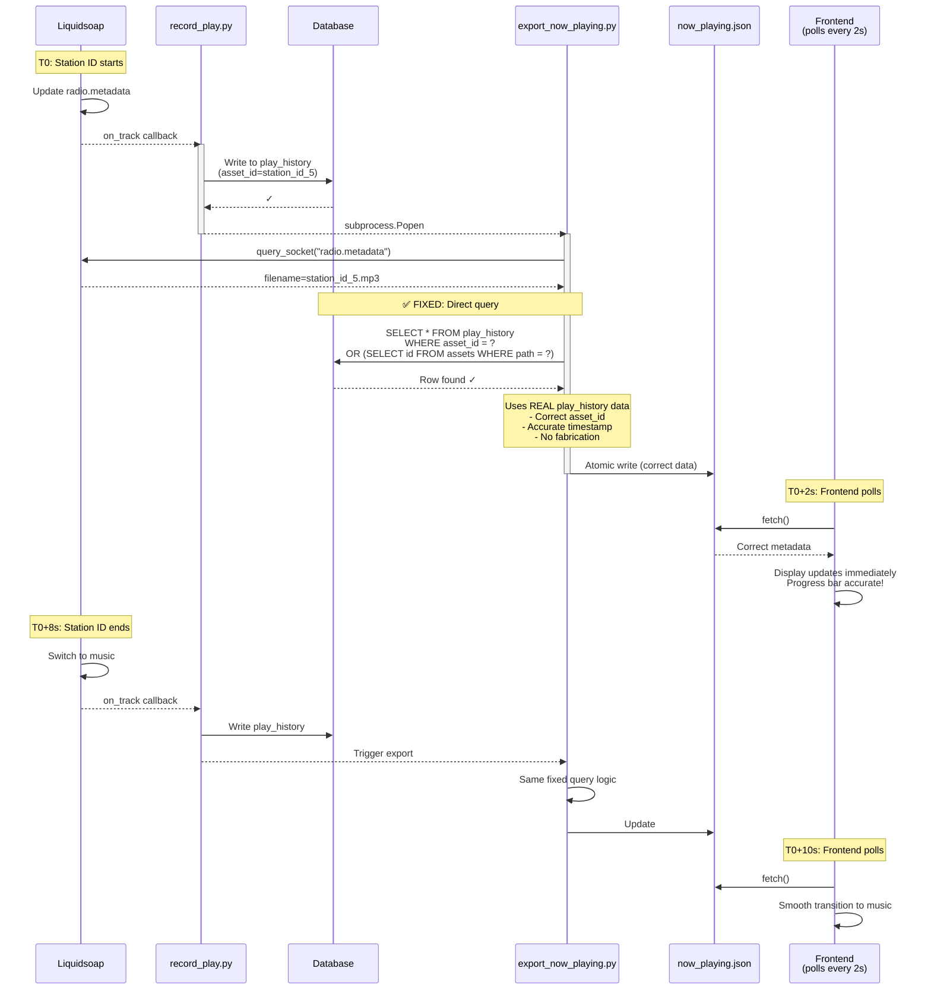

# Now Playing System - Sequence Diagram

## Current Flow (With Bugs)

## Problems Identified

### 🔴 Critical Bugs

1. **SQL Query Bug** (export_now_playing.py:586)
   - Uses `WHERE a.path = ?` after LEFT JOIN
   - Station IDs/breaks not in assets table → `a.path` is NULL
   - NULL comparison fails → query returns zero rows
   - Falls back to fabricated metadata with wrong timestamps

2. **Race Condition: Multiple Export Triggers**
   - Systemd timer runs every 10s
   - record_play.py also triggers export
   - Both can run simultaneously (lock prevents, but causes delays)
   - Timer can fire BEFORE database write completes

3. **Data Inconsistency**
   - Music tracks: SHA256 asset_id, in assets table
   - Station IDs/breaks: filename stem asset_id, NOT in assets table
   - Query logic assumes all tracks are in assets table

### 🟡 Architecture Issues

1. **Polling Latency**
   - Frontend polls every 5s
   - Export runs every 10s (timer) + immediate (trigger)
   - Total lag: up to 15 seconds worst case
   - Short tracks (3-5s) might be missed entirely

2. **Fabricated Metadata**
   - Missing asset_ids
   - Wrong timestamps (off by 100-500ms)
   - Progress bar calculations incorrect
   - Frontend can't properly detect track changes

## Proposed Fixed Flow

## Key Improvements

### ✅ Correctness Fixes

1. **Fix SQL Query**
   - Query play_history directly for station IDs/breaks
   - Fall back to assets table join only for music
   - No more fabricated metadata
   - Accurate timestamps from play_history

2. **Timer as Fallback**
   - Change systemd timer from 10s to 2-minute fallback
   - Primary exports triggered immediately by record_play.py
   - Eliminates race conditions (2min vs 10s)
   - Timer provides resilience if triggered export fails

### ✅ Real-Time Improvements

3. **Reduce Frontend Polling**
   - Change from 5s to 2s interval
   - Catches track changes faster
   - Better UX for short tracks
   - Still efficient (no excessive load)

4. **Future: Server-Sent Events (SSE)**
   - Push updates instead of polling
   - Sub-second latency
   - Efficient (no unnecessary requests)
   - Requires more changes (later phase)
